# Machine Learning

This is the lab where you’re going to do the work of building and training a machine learning model that will help Alpha Office.

Remember that we are trying to help Alpha Office predict the credit suitability of their customers. We can use machine learning to help us here because we already have a set of customers with known credit. Some customers are already using this service and we already have a table of customer data, that includes a column with credit information. This is what we are going to use to train a model that will predict for new customers, if their credit is suitable.

In this lab you will use Apache Zeppelin notebooks to do this work. The lab will help you create a new notebook, and also import an existing one with all the code, descriptions and examples that you need.

## Objectives

- Import a Apache Zepplin notebook.
- Become familiar with Oracle Machine Learning Algorithms.
- Create a machine learning model to determine factors that predict good credit.

## **Step 1:** Sign in to Oracle Cloud

- Log in, if you have not already done so.

  

  

  

  

## **Step 2:** Create ML User

- Navigate to your ADW Instance

  

- Select `Service Console`

  

- Select Administration

  

- Select `Manage Oracle ML Users.`

  

- Login as admin user and password that you assigned when you created the instance (admin and password you entered)

  

- Create a new ML user. Enter user `ml_user` and create a password.

  

  

## **Step 3:** Create ML Notebook

- Select the home icon upper right.

  

- Log in as `ml_user` and create your own password. Before you log in, you may wish to bookmark this page.

  

- Navigate around to get familiar with the ML pages. Click on  `Examples.`

  

- Note the various ML notebook examples. Feel free to review some of these. We will be creating a new ML notebook in this lab.

  

- Click on the upper left icon to bring back the menu. Then select `Notebooks.`

  

  

- We will create a notebook from the beginning, select `Create.`

  

- Enter `adwc_notebook` as the name, the click `OK`.

  

## **Step 4:** Import ML Notebook

- Now we have finished creating a ML notebook from scratch, let's import a pre-built notebook and use it for the remainder of the this lab.

- Navigate back to the Notebook page

  

- We will be importing a pre-built notebook, and using this for the remainder of the lab. Select `Import`.

  

- Go to the install directory in your git repository and import `Credit Score Predictons.json` notebook.

  

- Select the `Credit Score Predictions` notebook.

  

- Before you start working the `Credit Score Predictions` you need to set the interpreter binging. Click on the gear icon.

  

- Selection the `orcl_high` interpreter adn then `Save`.

  

The rest of this lab will be done interactively in the notebook.  The following area just screen shots for your convenience.

## Screen Shots of ML Notebook

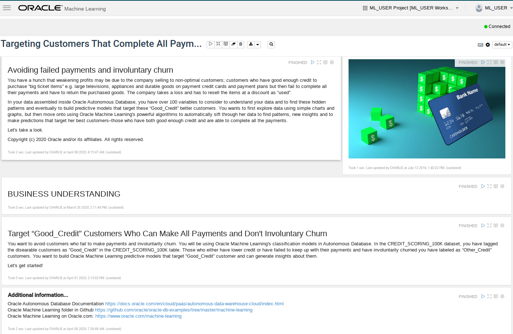

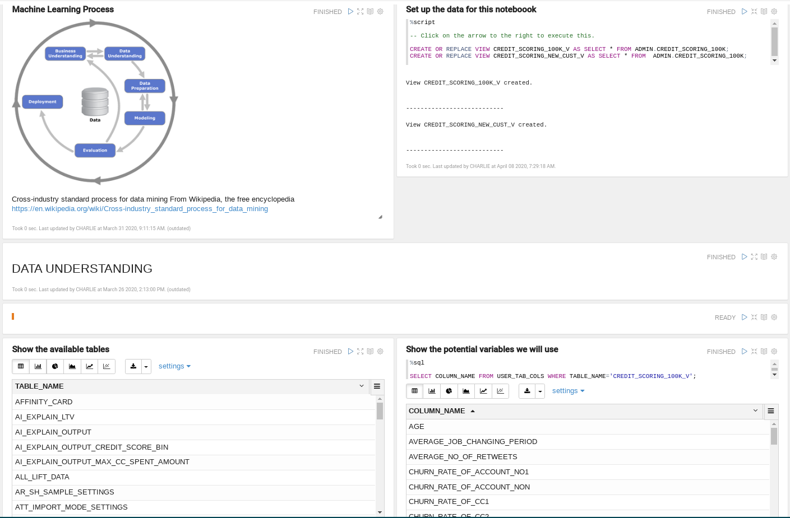

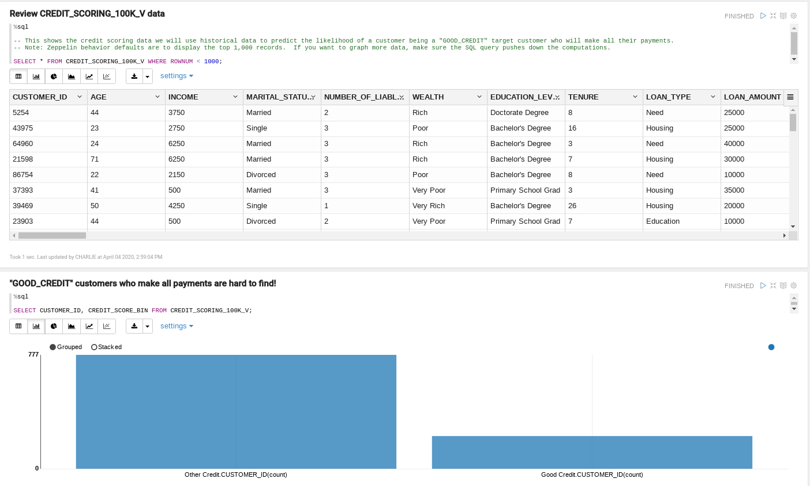

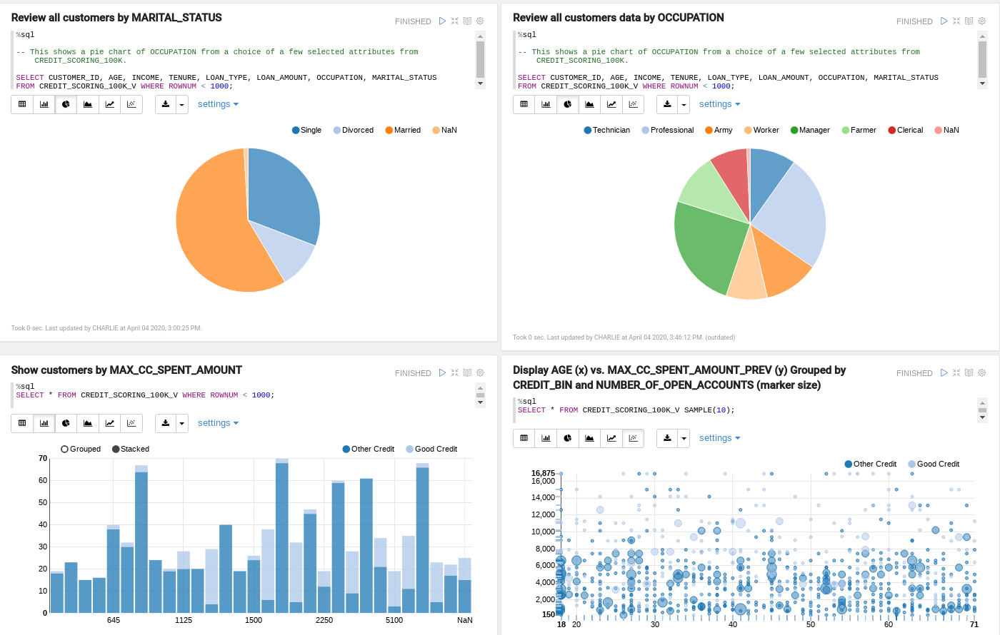

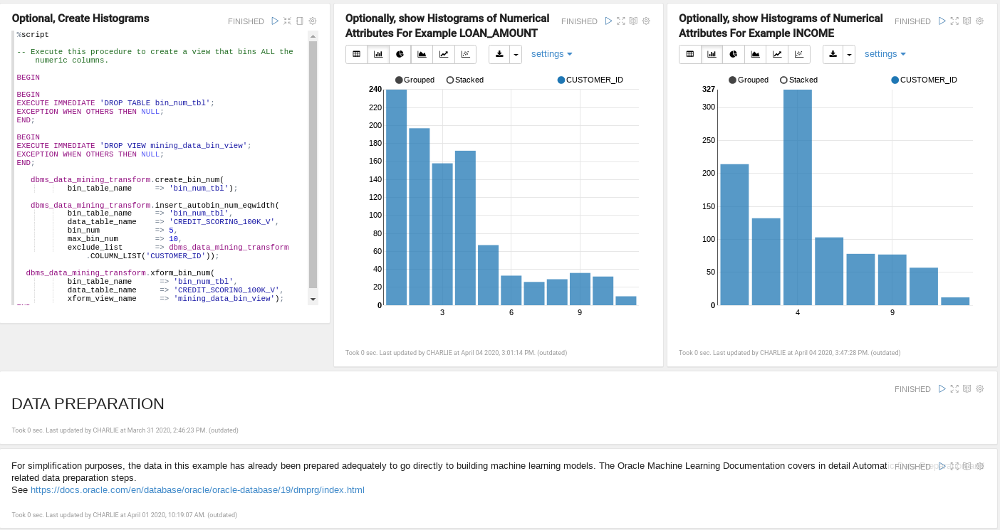

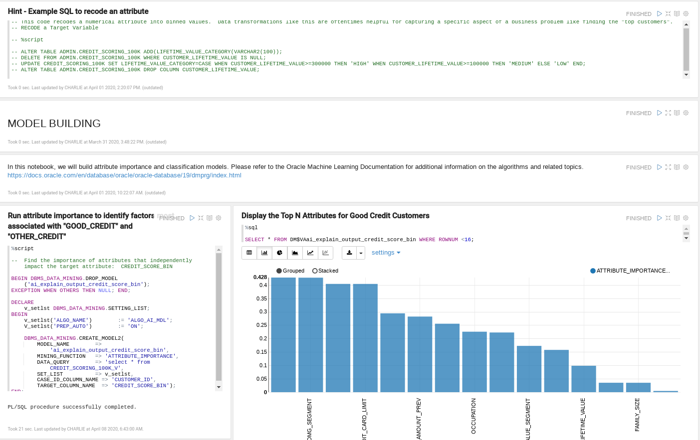

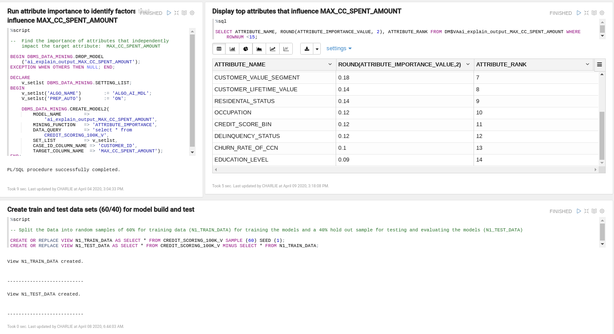

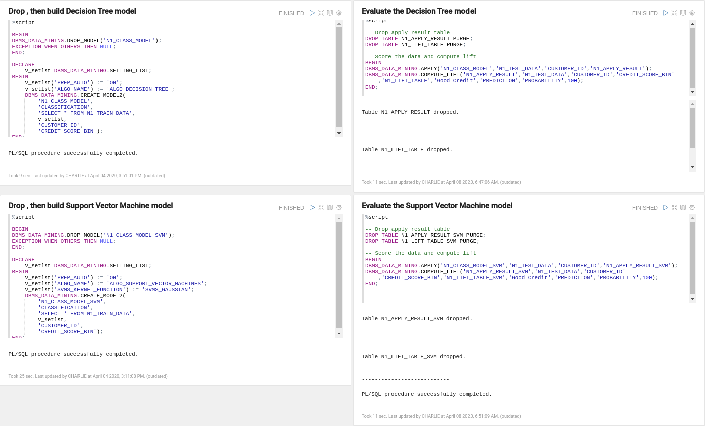

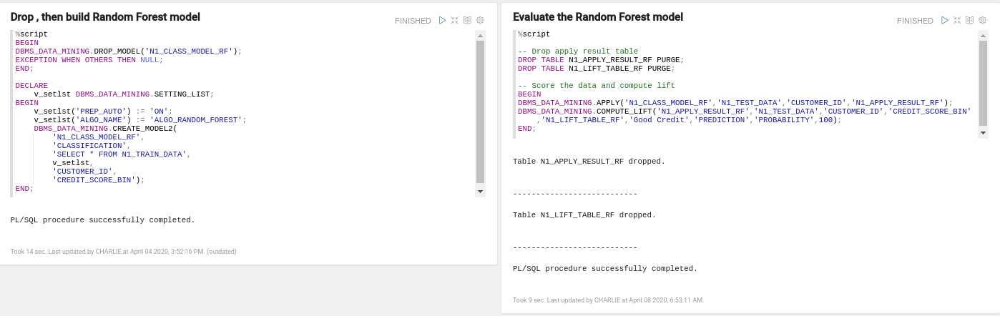

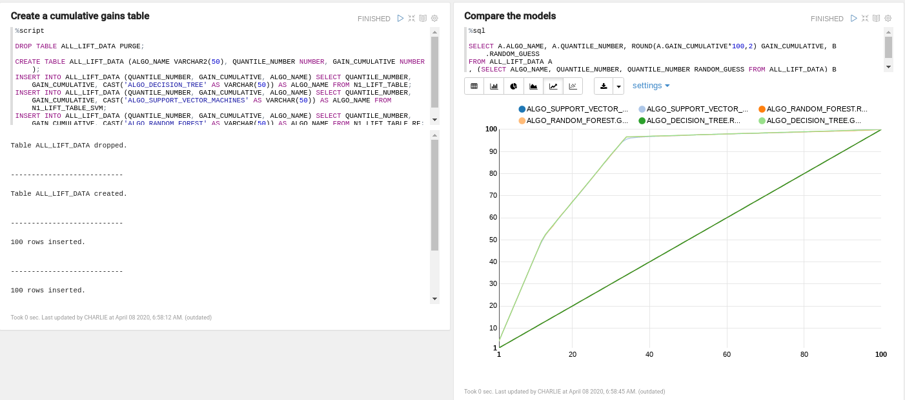

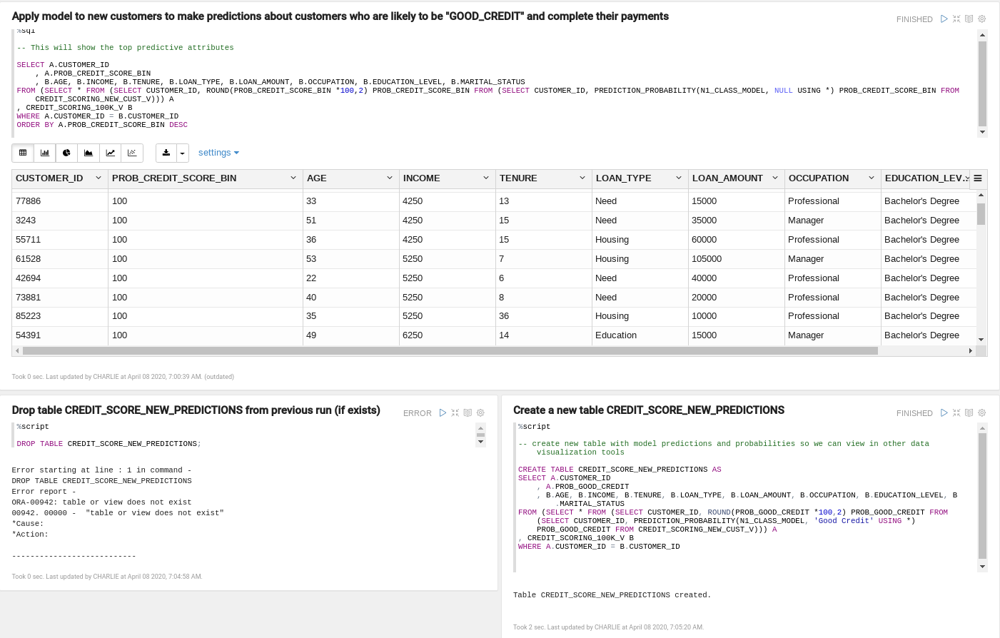

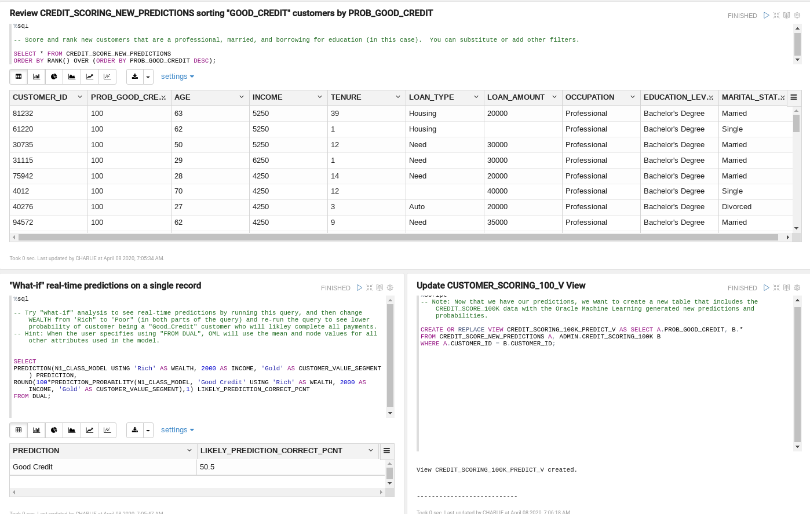

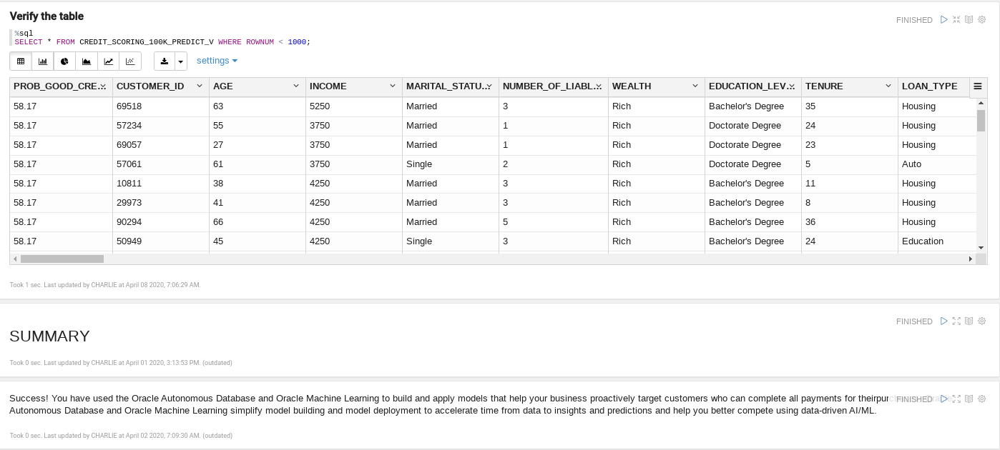

