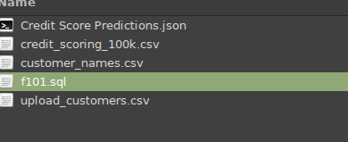
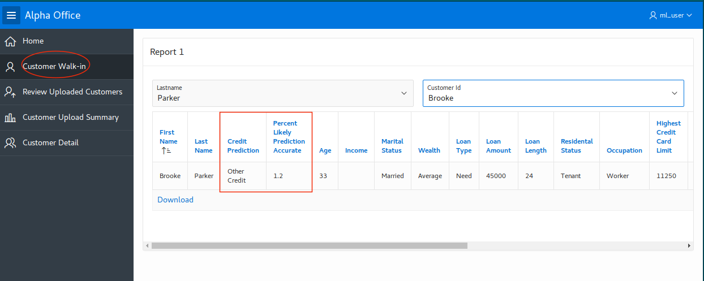

# Using Prediction in an Application

## Introduction

In this lab, you will:

- Import data to set up the lab.
- Import an APEX application.
- Review the application to see how you can make predictions on the fly.
- Expose your ml model as a REST end point so any application can use it.

## **Step 1:**Prep data for the lab.

- To show how an application would use ml predictions we'll add some customer names to the original credit_scoring_100k data set.  Navigate to the SQL Developer Web and log in with ml_user (if you are not already logged in from the previous lab).  Then select file upload on the left.

  

- Select the files button, and then the customer_names.csv file in the install directory.

  

- Accept the defaults and hit next.

  

- Change the customer\_id data type to number and change the lengths.

  

- Accept the remaining defaults.

  

- Create a view that combines the names with the credit_scoring_100k data set.
```
<copy>create or replace view ml_user.credit_scoring_100k_v as select a.first_name, a.last_name, b.*
from ml_user.customer_names a, credit_scoring_100k b
where a.customer_id(+)= b.customer_id;</copy>
```

  

- Create a new upload\_customers table.  This will be used in the application to show how newly loaded records can be scored on the fly.
```
<copy>create table upload_customers (
customer_id number
, first_name varchar2(100)
, last_name varchar2(100)
, wealth varchar2(4000)
, income number
, customer_dmg_segment varchar2(26)
, customer_value_segment varchar2(26)
, occupation varchar2(26)
, highest_credit_card_limit number
, delinquency_status varchar2(26)
, max_cc_spent_amount number
, max_cc_spent_amount_prev number
, residental_status varchar2(26)
, likely_good_credit_pcnt AS (round((100*(prediction_probability(n1_class_model, 'Good Credit' USING 
    wealth
  , customer_dmg_segment
  , income
  , highest_credit_card_limit
  , residental_status
  , max_cc_spent_amount_prev
  , max_cc_spent_amount
  , occupation
  , delinquency_status
  , customer_value_segment
  , residental_status))),1))
, credit_prediction AS (prediction(n1_class_model USING   
  wealth
  , customer_dmg_segment
  , income
  , highest_credit_card_limit
  , residental_status
  , max_cc_spent_amount_prev
  , max_cc_spent_amount
  , occupation
  , delinquency_status
  , customer_value_segment
  , residental_status))
);</copy>
```

  

## **Step 2:**Import the APEX Application

- Navigate to the ATP APEX application through the ATP Service Console.

  

- Select Development, then APEX.

  

- Enter your admin password.

  

- You will be prompted to create a workspace. 

  

- Select ML_USER for the workspace user and enter ML_APPLICATION for the workspace name.

  

  

- Sign out of user admin and log in with workspace ML_APPLICATION and user ML_USER.

  

  

   

- You will be prompted to set the new application password for ml_user.  Make the email proper (not necessarily valid) and accept defaults.

   

   

- Select App Builder.

   

- Select Import

   

- Select choose file, and then select the f101.sql file in the git repo and then accept the defaults.

   

   

   

   

   

   

   

   

- Log in as ml_user.

   

   

## **Step 3:**Run application and review on-the-fly prediction/scoring.

- Select Customer Walk-in from the menu.  Select last name and then first name.  Note the credit score prediction and the probability of that estimate.  These calculations are done as the data is queried.

   

-  Next we will upload new customers and score those as a batch.  Select the Home menu item at the bottom of the page.

   

- Select SQL Workshop.

   

- Select Utilities.

   

- Select Data Workshop.

   

- Select Load Data.

   

- Select the upload_customers.xlsx file.

   

- Load to existing table upload_customers.

   

   

- Return to the Alpha Office application.

   

   

- Run the application

   

- Now review the uploaded customers and note the predictions.

   

- Select Customer Upload Summary.  This provides a summary measure of the uploaded customer number of new good credit versus other credit customers.

   

- Select Overall Credit Profile.  This provides an overall measure of the credit across the entire 100k credit database.  This scoring of 100k customers with 10 variables takes less than a second.

   